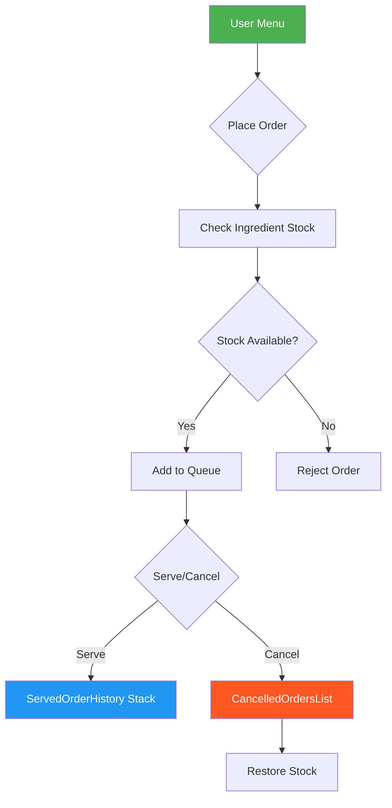

# 🍽️ Restaurant Order Management System

> **Java Console Application - Data Structures & Algorithms**

<div align="center">


</div>

---

## 📌 Overview

A **Java console application** that manages restaurant operations including order placement, kitchen queue management, stock tracking, and order history. Built with efficient data structures to handle real-time restaurant workflow.

**Team Project** | University of Jeddah | Software Engineering

---

## 🎯 Problem Statement

Restaurants need efficient systems to:
- ❌ Track dine-in vs. delivery orders separately
- ❌ Manage ingredient stock in real-time
- ❌ Handle order cancellations and stock restoration
- ❌ Maintain historical records for reporting
- ❌ Prioritize delivery orders for faster dispatch

---

## 💡 Solution

A menu-driven console application that:
- ✅ Accepts orders for both delivery and dine-in
- ✅ Checks ingredient availability before order confirmation
- ✅ Maintains separate queues for delivery (high priority) and dine-in orders
- ✅ Tracks stock levels with automatic deduction/restoration
- ✅ Records served and cancelled orders for history and reporting

---

## 🛠️ Technologies & Tools

| Technology | Purpose |
|------------|---------|
| **Java** | Core programming language |
| **Linked Lists** | Efficient order queue management (O(1) insertion) |
| **HashMaps** | Fast ingredient stock lookup (O(1) access) |
| **Stack-like Structure** | Served order history logging |
| **Git** | Version control and collaboration |

---

## 🏗️ System Architecture

### Core Classes

| Class | Purpose | Key Data Structure |
|-------|---------|-------------------|
| **MealOrder** | Encapsulates a single customer order | HashMap<MenuItem, Quantity> |
| **KitchenQueue** | Central order manager | Two Linked Lists (Delivery + Dine-In) |
| **IngredientStock** | Tracks available kitchen ingredients | HashMap<String, Integer> |
| **CancelledOrdersList** | Stores cancelled order records | Linked List |
| **ServedOrderHistory** | Logs completed orders for reference | Stack-like Linked List |

## 📊 Data Flow Diagram




## 🎨 User Menu
╔════════════════════════════════════╗ 

║ RESTAURANT ORDER MANAGEMENT ║ 

╠════════════════════════════════════╣ 

║ 1. Add Order ║ 

║ 2. Serve Order ║ 

║ 3. Cancel Order ║ 

║ 4. Show Current Orders (Queue) ║ 

║ 5. Show Served Orders ║ 

║ 6. Show Cancelled Orders ║

║ 7. Show Kitchen Stock ║ 

║ 8. Exit ║

╚════════════════════════════════════╝


---

## ⚙️ Key Features

### 1. Order Placement
- Accepts delivery and dine-in orders
- Validates ingredient availability before confirmation
- Automatically deducts used ingredients from stock

### 2. Order Fulfillment
- Maintains separate queues: **Delivery** (high priority) and **Dine-In** (standard)
- O(1) insertion time using Linked Lists for fast order processing
- Tracks order status from placement to service

### 3. Order Cancellation
- Cancel orders by Order ID
- Automatically restores cancelled ingredients to stock
- Logs cancelled orders for audit purposes

### 4. Stock Management
- Real-time tracking of ingredient quantities
- Prevents orders when ingredients are insufficient
- Automatic stock restoration on cancellation

### 5. Order History
- Maintains records of served orders for reporting
- Stack-based structure for efficient logging (O(1) push)

---

## 📊 Sample Stock Items

| Ingredient | Initial Quantity |
|------------|-----------------|
| Chicken Breast | 50 |
| Lettuce Head | 30 |
| Tomato | 40 |
| Bread Loaf | 25 |
| Steak Cut | 20 |
| Pasta Bag | 35 |

---

## 💻 Code Highlights

### Ingredient Stock Check (O(1) Lookup)
```java
public boolean checkAndDeductStock(HashMap<String, Integer> orderItems) {
    for (Map.Entry<String, Integer> item : orderItems.entrySet()) {
        String ingredient = item.getKey();
        int required = item.getValue();
        
        if (!stock.containsKey(ingredient) || stock.get(ingredient) < required) {
            return false; // Insufficient stock
        }
    }
    
    // Deduct stock
    for (Map.Entry<String, Integer> item : orderItems.entrySet()) {
        stock.put(item.getKey(), stock.get(item.getKey()) - item.getValue());
    }
    return true;
}
```
## Dual Queue Management

```
public void addOrder(MealOrder order) {
    if (order.isDelivery()) {
        deliveryQueue.addLast(order);  // High priority
    } else {
        dineInQueue.addLast(order);    // Standard priority
    }
}

public MealOrder serveNextOrder() {
    // Prioritize delivery orders
    if (!deliveryQueue.isEmpty()) {
        return deliveryQueue.removeFirst();
    }
    return dineInQueue.isEmpty() ? null : dineInQueue.removeFirst();
}
```
## Stock Restoration on Cancellation
```
public void cancelOrder(String orderId) {
    MealOrder cancelled = findAndRemoveOrder(orderId);
    if (cancelled != null) {
        restoreStock(cancelled.getItems());
        cancelledList.add(new CancelledOrderNode(cancelled));
    }
}

private void restoreStock(HashMap<String, Integer> items) {
    for (Map.Entry<String, Integer> item : items.entrySet()) {
        stock.put(item.getKey(), 
            stock.getOrDefault(item.getKey(), 0) + item.getValue());
    }
}
```
### 📁 Project Structure
```

Restaurant-Order-System/ ├── src/ │ ├── Main.java │ ├── classes/ │ │ ├── MealOrder.java │ │ ├── KitchenQueue.java │ │ ├── IngredientStock.java │ │ ├── CancelledOrderNode.java │ │ ├── CancelledOrdersList.java │ │ └── ServedOrderHistory.java │ └── utils/ │ └── MenuHandler.java └── docs/ ├── project_report.pdf └── user_manual.pdf

```

### 🖼️ Sample Output

╔════════════════════════════════════╗

║   RESTAURANT ORDER MANAGEMENT      ║

╠════════════════════════════════════╣

║  Enter choice: 1                   ║

║                                    ║

║  >> Place New Order                ║

║  Order Type: [1] Dine-in  [2] Delivery: 2

║  Table/Address: King Fahd St.      ║

║  Items: Chicken Breast x2, Rice x1 ║

║                                    ║

║  ✓ Order #1001 placed successfully!║

║  ✓ Stock updated.                  ║

╚════════════════════════════════════╝


## 👥 Team

| Name | Role |
|------|------|
| **Ibrahim Eissa** |Leader|
| **Abdullah Misar** | Member |
| **Ryan Khaled** | Member |
| **Yazeed Bafaqih** |Member|

## 📧 Contact

**Ibrahim Eissa Abu Alghayth**

-📧 ibrahim.abualg@gmail.com

-🔗 LinkedIn: https://linkedin.com/in/yourname

-🐙 GitHub: https://github.com/Ibrah1m1

-📄 Project Documentation
[_Project_DB.pdf](https://github.com/user-attachments/files/25886410/_Project_DB.pdf)


## 🔗 Related Links

- [Java Documentation](https://docs.oracle.com/javase/)
- [Data Structures Tutorial](https://www.geeksforgeeks.org/data-structures/)
- [OOP Principles](https://www.geeksforgeeks.org/object-oriented-programming-oops-concept-in-java/)

Made with ❤️ by the Healthify Team


